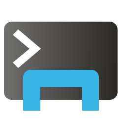
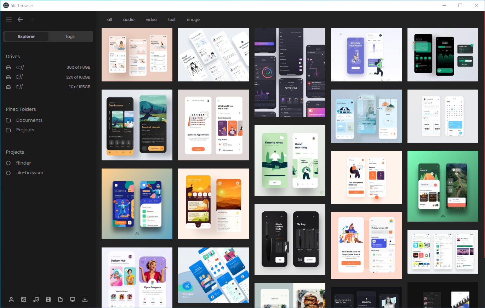
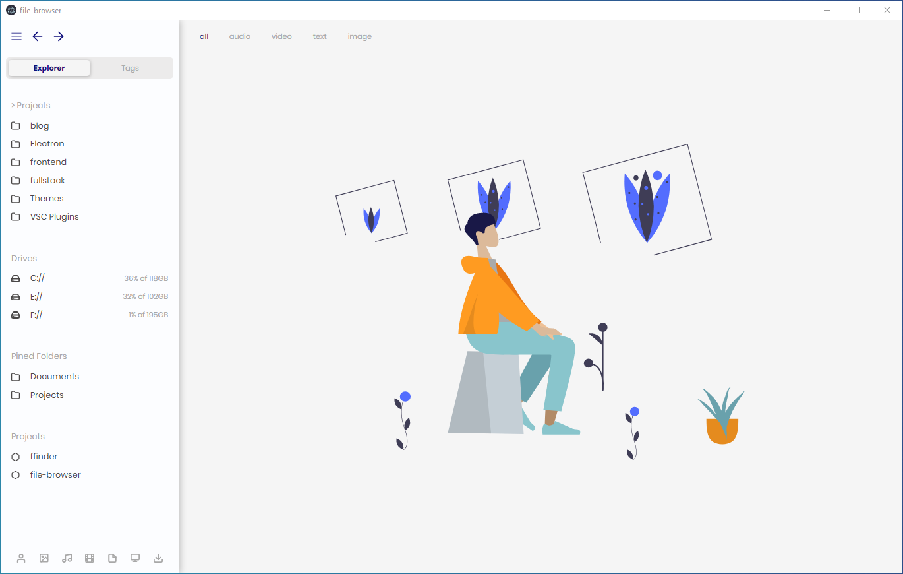

> ⚠ **this is just a beta v0.0.1**, expect errors ; and some messing functionality

<div  align="center">
    
</div>

<h1  align="center" >File Browser</h1>


A minimal file explorer designed for **front-end developers** 🎉 , built with [React](https://reactjs.org) and [Electron](https://www.electronjs.org)

## technologies

**file-browser** is an Electron js application therefore it uses web technologies (JavaScript, HTML, and CSS ) like any other website,

[](https://reactjs.org)
[](https://www.electronjs.org)
[](https://webpack.js.org)
[](https://sass-lang.com)
[](https://github.com/louischatriot/nedb)
[](https://www.npmjs.com/package/node-disk-info)
[](https://github.com/electron-userland/electron-builder)
[](https://redux.js.org)

## Usage

first clone or download projects code to your local directory , then install dependencies

```
# Clone the repository
git clone https://github.com/Abachouch/file-browser.git

# Go into the repository
cd file-browser

# Install the dependencies
yarn
```

to start electron app

```
# first build the react app
yarn build

# then run electron
yarn start
```

to generate `file-browser Setup 0.0.1.exe` (for now its windows only 😁)

```
yarn build
yarn dist
```

in the dist folder click on the executable 🚀 (enjoy)

## Features :

- [x] run scripts in package.json
- [x] save folders as projects
- [x] filter files by type
- [x] pin Folders
- [x] tag files
- [x] copy svg code
- [x] show text files
- [x] open in external apps
- [x] builtin audio player
- [x] themes ( dark / light / blue )


## TODO

- [ ] save files in moodboards
- [ ] get color palete from images
- [ ] create new a nodejs Project
- [ ] git integration
- [ ] resize image for web
- [ ] highlight code
- [ ] control the view of image preview
- [ ] build for linux

---

## Screenshots






## License

GNU/GPL Version 3
